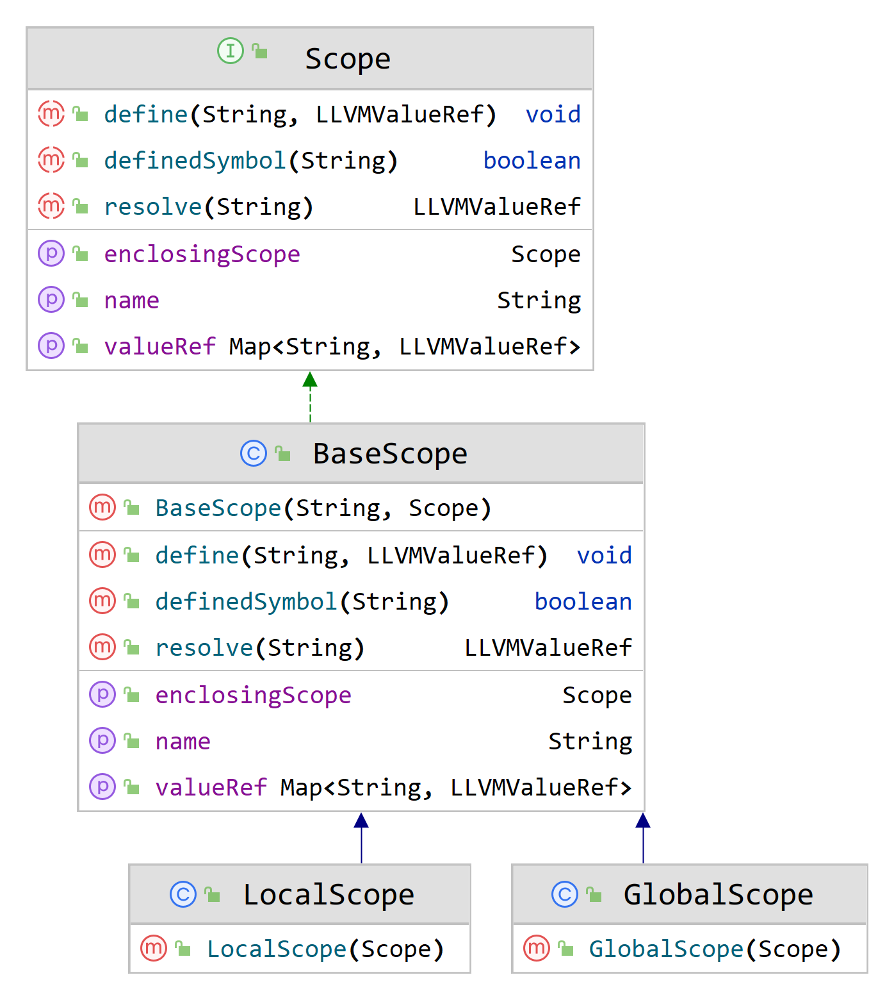

# 编译原理 Lab5 实验报告

姓名：熊丘桓

学号：201250127

邮箱：<eaglebear@smail.nju.edu.cn>

## 实现功能

本次实验完成了以下功能：

1. 函数定义与调用
1. 局部变量

## 实验设计

本次实验参照助教在文档中的提示，对符号表做了如下设计。注意本次实验中符号表不再依赖 `Symbol` 和 `Type` 包，而是直接存储 `String` 对 `LLVMValueRef` 的映射。



本次实验重新设计了 `LLVMVisitor` 类，部分代码如下：

```java
public class LLVMIRVisitor extends SysYParserBaseVisitor<LLVMValueRef> {
	private final LLVMModuleRef module = LLVMModuleCreateWithName("module");
	private final LLVMBuilderRef builder = LLVMCreateBuilder();
	private final LLVMTypeRef i32Type = LLVMInt32Type();
	private final LLVMTypeRef voidType = LLVMVoidType();
	private final LLVMValueRef zero = LLVMConstInt(i32Type, 0, 0);
	
	public LLVMIRVisitor() {
		LLVMInitializeCore(LLVMGetGlobalPassRegistry());
		LLVMLinkInMCJIT();
		LLVMInitializeNativeAsmPrinter();
		LLVMInitializeNativeAsmParser();
		LLVMInitializeNativeTarget();
	}
	
	@Override
	public LLVMValueRef visitTerminal(TerminalNode node) {
		if (symbolType == SysYParser.INTEGR_CONST) {
			return LLVMConstInt(i32Type, number, 0);
		}
		return super.visitTerminal(node);
	}
    
	@Override
	public LLVMValueRef visitFuncDef(SysYParser.FuncDefContext ctx) {
		int paramsCount;
		
		PointerPointer<Pointer> paramsTypes = new PointerPointer<>(paramsCount);
		String retTypeName = ctx.funcType().getText();
		LLVMTypeRef retType = getTypeRef(retTypeName);
		LLVMTypeRef functionType = LLVMFunctionType(retType, paramsTypes, paramsCount, 0);
		String functionName = ctx.IDENT().getText();
		LLVMValueRef function = LLVMAddFunction(module, functionName, functionType);
		LLVMBasicBlockRef entry = LLVMAppendBasicBlock(function, functionName + "_entry");
		LLVMPositionBuilderAtEnd(builder, entry);
		
		for (int i = 0; i < paramsCount; ++i) {
			SysYParser.FuncFParamContext funcFParamContext = ctx.funcFParams().funcFParam(i);
			String paramTypeName = funcFParamContext.bType().getText();
			LLVMTypeRef paramType = getTypeRef(paramTypeName);
			String varName = ctx.funcFParams().funcFParam(i).IDENT().getText();
			LLVMValueRef varPointer = LLVMBuildAlloca(builder, paramType, "pointer_" + varName);
			currentScope.define(varName, varPointer);
			LLVMValueRef argValue = LLVMGetParam(function, i);
			LLVMBuildStore(builder, argValue, varPointer);
		}
        
		return function;
	}
	
	@Override
	public LLVMValueRef visitVarDecl(SysYParser.VarDeclContext ctx) {
		for (SysYParser.VarDefContext varDefContext : ctx.varDef()) {
			LLVMValueRef varPointer = LLVMBuildAlloca(builder, varType, "pointer_" + varName);
			
			if (varDefContext.ASSIGN() != null) {
				SysYParser.ExpContext expContext = varDefContext.initVal().exp();
				if (expContext != null) {
					LLVMValueRef initVal = visit(expContext);
					LLVMBuildStore(builder, initVal, varPointer);
				} else {
					int initValCount = varDefContext.initVal().initVal().size();
					LLVMValueRef[] initArray = new LLVMValueRef[elementCount];
					// fill in initArray
					buildGEP(elementCount, varPointer, initArray);
				}
			}
			
			currentScope.define(varName, varPointer);
		}
		
		return null;
	}
	
	private void buildGEP(int elementCount, LLVMValueRef varPointer, LLVMValueRef[] initArray) {
        // 这里展示的是方法的全部代码
		LLVMValueRef[] arrayPointer = new LLVMValueRef[2];
		arrayPointer[0] = zero;
		for (int i = 0; i < elementCount; i++) {
			arrayPointer[1] = LLVMConstInt(i32Type, i, 0);
			PointerPointer<LLVMValueRef> indexPointer = new PointerPointer<>(arrayPointer);
			LLVMValueRef elementPtr = LLVMBuildGEP(builder, varPointer, indexPointer, 2, "GEP_" + i);
			LLVMBuildStore(builder, initArray[i], elementPtr);
		}
	}
    
	@Override
	public LLVMValueRef visitLValExp(SysYParser.LValExpContext ctx) {
		LLVMValueRef lValPointer = this.visitLVal(ctx.lVal());
		return LLVMBuildLoad(builder, lValPointer, ctx.lVal().getText());
	}
	
	@Override
	public LLVMValueRef visitLVal(SysYParser.LValContext ctx) {
		LLVMValueRef varPointer = currentScope.resolve(lValName);
		if (ctx.exp().size() == 0) {
			return varPointer;
		} else {
			LLVMValueRef[] arrayPointer = new LLVMValueRef[2];
			arrayPointer[0] = zero;
			LLVMValueRef index = this.visit(ctx.exp(0));
			lValName += "[" + ctx.exp(0).getText() + "]";
			arrayPointer[1] = index;
			PointerPointer<LLVMValueRef> indexPointer = new PointerPointer<>(arrayPointer);
			return LLVMBuildGEP(builder, varPointer, indexPointer, 2, "pointer_" + lValName);
		}
	}
	
	@Override
	public LLVMValueRef visitAssignment(SysYParser.AssignmentContext ctx) {
		LLVMValueRef lValPointer = this.visitLVal(ctx.lVal());
		LLVMValueRef exp = this.visit(ctx.exp());
		return LLVMBuildStore(builder, exp, lValPointer); 
	}
	
	@Override
	public LLVMValueRef visitFuncCallExp(SysYParser.FuncCallExpContext ctx) {
		String functionName = ctx.IDENT().getText();
		LLVMValueRef function = currentScope.resolve(functionName);
		PointerPointer<Pointer> args = null;
		int argsCount = 0;
		if (ctx.funcRParams() != null) {
			argsCount = ctx.funcRParams().param().size();
			args = new PointerPointer<>(argsCount);
			for (int i = 0; i < argsCount; ++i) {
				SysYParser.ParamContext paramContext = ctx.funcRParams().param(i);
				SysYParser.ExpContext expContext = paramContext.exp();
				args.put(i, this.visit(expContext));
			}
		}
		return LLVMBuildCall(builder, function, args, argsCount, "");
	}
	
	@Override
	public LLVMValueRef visitReturnStmt(SysYParser.ReturnStmtContext ctx) {
		LLVMValueRef result = null;
		if (ctx.exp() != null) {
			result = visit(ctx.exp());
		}
		return LLVMBuildRet(builder, result);
	}
}
```


## 实验困难

笔者初始设计方案是将整形字面常量取值并在 java 中计算表达式求值，但该方案在 OJ 上仅得到了 1300 分（满分 3100）。

修改为调用 `LLVMBuildSDiv` 等 API 计算代替算术计算后得到了满分。

```java
@Override
public LLVMValueRef visitMulExp(SysYParser.MulExpContext ctx) {
    LLVMValueRef valueRef1 = visit(ctx.exp(0));
    LLVMValueRef valueRef2 = visit(ctx.exp(1));
    if (ctx.MUL() != null) {
        return LLVMBuildMul(builder, valueRef1, valueRef2, "tmp_");
    } else if (ctx.DIV() != null) {
        return LLVMBuildSDiv(builder, valueRef1, valueRef2, "tmp_");
    } else {
        return LLVMBuildSRem(builder, valueRef1, valueRef2, "tmp_");
    }
}
```

## 测试用例
