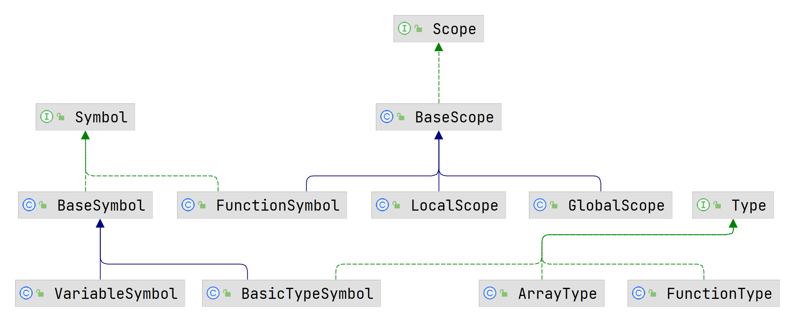

# 编译原理 Lab3 实验报告

## 实现功能

本次实验完成了以下功能：

1. 类型检查
2. 重命名

## 实验设计

笔者参考老师上课的演示代码和助教在文档中的提示，做出如下类设计。该设计采取了依赖倒置原则。



在实现功能方面，笔者采用了如下思路：

1. 通过 `Visitor` 对语法树进行遍历，遍历过程中输出语义错误；
2. 在 `visitTerminal` 方法中，对每个 `Symbol` 记录变量名、函数名的出现位置，并存储待输出语法树内容；
3. 如果语法树中无语义错误，则输出语法树的内容，输出过程中对待重命名的变量、函数进行重命名。

整个过程总共遍历语法树一遍。

## 实验困难

实验主要困难在于上述设计，特别是对 `getLValType`，`getExpType` 和 `getCondType` 等递归方法的独立设计。

在此以 `getExpType` 为例给出代码：

```java
private Type getExpType(SysYParser.ExpContext ctx) {
    if (ctx.IDENT() != null) { // IDENT L_PAREN funcRParams? R_PAREN
        String funcName = ctx.IDENT().getText();
        Symbol symbol = currentScope.resolve(funcName);
        if (symbol != null && symbol.getType() instanceof FunctionType) {
            FunctionType functionType = (FunctionType) currentScope.resolve(funcName).getType();
            ArrayList<Type> paramsType = functionType.getParamsType(), argsType = new ArrayList<>();
            if (ctx.funcRParams() != null) {
                for (SysYParser.ParamContext paramContext : ctx.funcRParams().param()) {
                    argsType.add(getExpType(paramContext.exp()));
                }
            }
            if (paramsType.equals(argsType)) {
                return functionType.getRetType();
            }
        }
    } else if (ctx.L_PAREN() != null) { // L_PAREN exp R_PAREN
        return getExpType(ctx.exp(0));
    } else if (ctx.unaryOp() != null) { // unaryOp exp
        return getExpType(ctx.exp(0));
    } else if (ctx.lVal() != null) { // lVal
        return getLValType(ctx.lVal());
    } else if (ctx.number() != null) { // number
        return new BasicTypeSymbol("int");
    } else if (ctx.MUL() != null || ctx.DIV() != null || ctx.MOD() != null || ctx.PLUS() != null || ctx.MINUS() != null) {
        Type op1Type = getExpType(ctx.exp(0));
        Type op2Type = getExpType(ctx.exp(1));
        if (op1Type.toString().equals("int") && op2Type.toString().equals("int")) {
            return op1Type;
        }
    }
    return new BasicTypeSymbol("noType");
}
```

该方法用于计算某个 `ExpContext` 的类型，主要用于判断该表达式内部是否有语义错误和类型不兼容。利用递归的思想，笔者还设计了 `getLValType` 和 `getCondType`，分别用来计算左值的类型和条件子句的类型及其合法性。