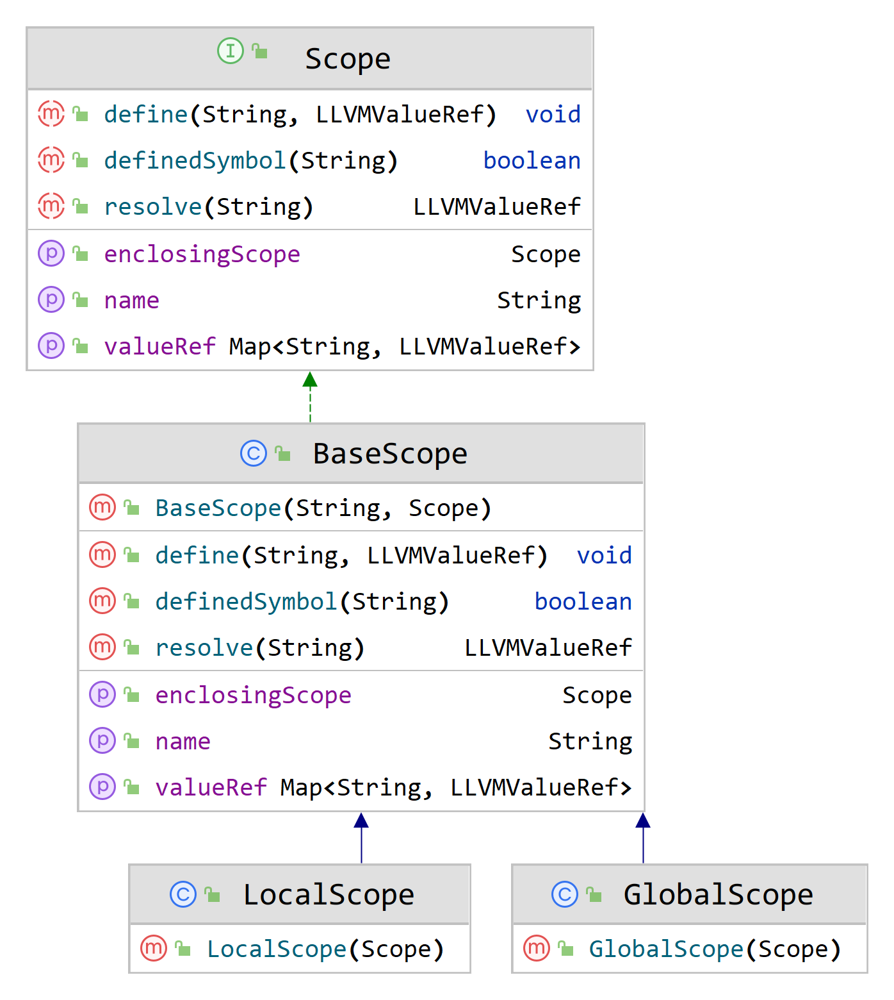

# 编译原理 Lab5 实验报告

## 实现功能

本次实验完成了以下功能：

1. 函数定义与调用
1. 局部变量

## 实验设计

本次实验参照助教在文档中的提示，对符号表做了如下设计。注意本次实验中符号表不再依赖 `Symbol` 和 `Type` 包，而是直接存储 `String` 对 `LLVMValueRef` 的映射。

本次实验重新设计了 `LLVMVisitor` 类。

## 实验困难

试验过程中笔者通过和王星云同学交流掌握了部分 API 的使用方法。笔者向助教求助解决了 `expected instruction opcode` 的测试用例报错问题。
